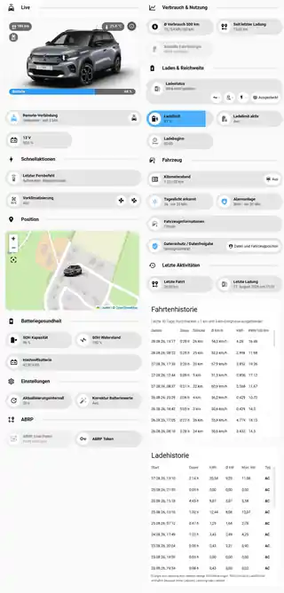
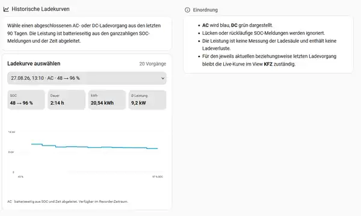

# e-C3 Dashboard for Home Assistant

A HACS integration that builds a multilingual e-C3 dashboard on top of
[Stellantis Vehicles](https://github.com/andreadegiovine/homeassistant-stellantis-vehicles).

> Development status: pre-release. The integration is intended for HACS custom
> repositories and requires a public GitHub repository.

[](https://my.home-assistant.io/redirect/hacs_repository/?owner=CaneTLOTW&repository=e_c3_dashboard&category=integration)

Use this button to open the repository directly in HACS. It must be added as an
**Integration**, not as a Dashboard element.

## What it provides

- A Home Assistant setup flow that discovers a connected Stellantis vehicle.
- A package-owned Community Dashboard strategy: no VIN, entity IDs, or dashboard YAML must be copied.
- A generated vehicle dashboard with live vehicle state, range, battery/SOC,
  charging state, preconditioning controls, position, battery health, trip and
  charge history, charging curves and long-term statistics.
- The LIVE hero exposes native Home Assistant More Info for range and for the
  currently displayed temperature/charging value while preserving the compact
  reference-dashboard pill layout.
- Vehicle and maintenance details share one popup: maintenance is shown first,
  followed by vehicle data; the former standalone vehicle-information card is
  no longer duplicated in the Vehicle view.
- Administrative controls are kept out of the Vehicle view: refresh/battery
  correction settings and ABRP controls live in the System view.
- A reusable compact Home Assistant card,
  `custom:e-c3-dashboard-vehicle-overview-card`, for dashboards such as a home
  or mobility overview. With one configured e-C3 entry it is zero-config.
- The generated LIVE vehicle hero and the reusable overview card share the same
  vehicle-overview implementation, including the live tracker `entity_picture`.
- Portable local metrics for trips, charging, GPS history, wake-up and optional notifications.
  On first start, the distance since charge is reconciled from compatible
  Stellantis Recorder history when it is still available.
- GPS history that combines Home Assistant Recorder points with canonical
  server-side trip geometry while keeping the current vehicle marker visible.
- Multi-vehicle support: one config entry creates one dashboard, visible
  dashboard names can be customized, and the compact card can be bound to a
  specific `entry_id` when more than one vehicle is configured.
- A UI that requires Bubble Card, Button Card, ha-map-card and layout-card.
- A scoped compatibility shim for the e-C3 vehicle picture marker in ha-map-card:
  transparent vehicle images remain transparent in browser/HA dark mode without
  changing unrelated map markers.
- German and English user interfaces: native HA translations for setup/options,
  a shared frontend catalog for dashboard cards, and a backend catalog for
  notifications and Logbook messages.

## Compact vehicle overview card

For a single configured vehicle, the portable card only needs:

```yaml
type: custom:e-c3-dashboard-vehicle-overview-card
```

It shows the same core mobility information as the LIVE hero: vehicle picture,
range, temperature or charging information, preconditioning, cable/driving
state and the battery/SOC bar. Range and the right-hand status pill open native
Home Assistant More Info for the value currently shown. Tapping the vehicle
opens the generated e-C3 `/vehicle` view.


See [the vehicle overview card guide](docs/VEHICLE_OVERVIEW_CARD.md) for optional
`entry_id`, navigation and heading configuration.

## Required HACS dependencies

Install **and fully configure** these before creating the dashboard:

1. [Stellantis Vehicles](https://github.com/andreadegiovine/homeassistant-stellantis-vehicles)
2. [Bubble Card](https://github.com/Clooos/Bubble-Card)
3. [Button Card](https://github.com/custom-cards/button-card)
4. [ha-map-card](https://github.com/nathan-gs/ha-map-card)
5. [layout-card](https://github.com/thomasloven/lovelace-layout-card)

The integration verifies prerequisites and displays an explicit setup status
instead of creating a dashboard with missing custom elements.

In particular, finish the Stellantis Vehicles login and vehicle setup first.
Only add e-C3 Dashboard after the selected vehicle is visible in Home Assistant
with usable battery, mileage and vehicle-tracker entities. Installing the
upstream repository alone is not sufficient. Bubble Card, Button Card,
ha-map-card and layout-card must likewise be loaded as Lovelace resources (not
merely shown as downloaded in HACS). The config flow shows a resource preflight
before vehicle selection; the dashboard then verifies the cards in the browser
before rendering any custom-card view.

## Installation flow

1. Add this repository in HACS as an **Integration**.
2. Download it and restart Home Assistant.
3. Add **e-C3 Dashboard** in **Settings → Devices & services**.
4. Select the upstream Stellantis vehicle and desired modules.
   Enable **Notification and recipient controls**, choose one or more existing
   Home Assistant Notify services, and submit the options form if you want to
   use vehicle notifications.
5. The integration creates a new **e-C3** dashboard automatically. Open it from
   the sidebar after setup. It is created once, never overwrites an existing
   dashboard, and is not deleted with the integration.

Installation never sends a notification and never performs an automatic
wake-up. The generated **Notifications** and **Wake-up** views contain all
package switches, initially off. Turn on the master switch, the desired report
category and each selected recipient deliberately; automatic wake-up is
controlled separately.

Documentation is maintained in English. See [the architecture concept](docs/CONCEPT.md)
and the [entity catalog with data-quality notes](docs/ENTITY_CATALOG.md). Notification
and wake-up semantics are described in
[the notification guide](docs/NOTIFICATIONS_AND_WAKEUP.en.md). The current
e-C3 remote-action audit and the difference between a visible button and a
confirmed vehicle capability are documented in
[the e-C3 capability matrix](docs/STELLANTIS_EC3_CAPABILITY_MATRIX.en.md).
For support, contribution and automation guidance, see
[SUPPORT.md](SUPPORT.md), [CONTRIBUTING.md](CONTRIBUTING.md), and
[AGENTS.md](AGENTS.md). Community rules and the difference between Issues and
Discussions are described in the [community guide](docs/COMMUNITY.en.md).

## Look & Feel

### Generated dashboard

The automatically generated dashboard keeps the Vehicle view focused on live
vehicle state, usage, charging, history and vehicle information. The combined
vehicle/maintenance popup is opened from the LIVE hero, while integration
settings and ABRP configuration are grouped in the System view. Additional
views provide trips, charging curves, GPS history and statistics.



### Charging history and curves

Completed AC/DC charging sessions can be selected from the charging-history
view. The curve is reconstructed from the available SOC/time history and is
explicitly presented as battery-side derived data rather than a meter-grade
wallbox measurement.



The screenshots show example runtime data. Vehicle values are dynamic and are
not part of the integration configuration.

## Development

The runtime integration is located in `custom_components/e_c3_dashboard/`.
It is deliberately independent of Stellantis API internals: it only reads
Home Assistant entities created by the upstream integration.

Home Assistant registers exactly one package-owned Lovelace resource:
`/e_c3_dashboard/frontend.js`. Package cards and compatibility helpers are
loaded as internal ES modules from that entry point. GPS and map-marker behavior
therefore do not require separate e-C3 Lovelace resources or a Strategy
post-patch chain.

## Privacy and trademark notice

This is an independent community project and is not affiliated with, endorsed
by, or supported by Citroën, Stellantis, or their affiliates. The integration
does not send vehicle data to this repository or any project-operated service.
Do not include VINs, vehicle locations, credentials, account IDs, or raw Home
Assistant exports in issues, discussions, or pull requests.

## License

[MIT License](LICENSE) © 2026 CaneTLOTW.
