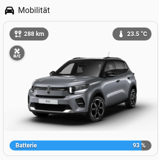

# e-C3 Dashboard for Home Assistant

A HACS integration that builds a multilingual, vehicle-focused Home Assistant
experience on top of
[Stellantis Vehicles](https://github.com/andreadegiovine/homeassistant-stellantis-vehicles).
It provides both a generated multi-view dashboard and a compact card that can be
used on an existing Home Assistant start page or mobility dashboard.

> Development status: pre-release. The integration is intended for HACS custom
> repositories and requires a public GitHub repository.

[](https://my.home-assistant.io/redirect/hacs_repository/?owner=CaneTLOTW&repository=e_c3_dashboard&category=integration)

Use this button to open the repository directly in HACS. Add it as an
**Integration**, not as a Dashboard element.

## What it provides

- A Home Assistant setup flow that discovers a configured Stellantis vehicle and
  maps its entities dynamically; no VIN, fixed entity IDs or dashboard YAML need
  to be copied into the package.
- One generated e-C3 dashboard per config entry, with dedicated **Vehicle**,
  **Charging**, **Statistics**, **Trips**, **GPS**, **Wake-up**,
  **Notifications**, and **System** views.
- A deliberately separated UI structure: current vehicle state stays in
  **Vehicle / LIVE**, detailed histories live in their dedicated views, and
  integration administration stays in **System**.
- A reusable compact Home Assistant card,
  `custom:e-c3-dashboard-vehicle-overview-card`, for a home page or mobility
  overview. With one configured e-C3 entry it is zero-config.
- Historical AC/DC charging sessions with reconstructed SOC/time curves.
- Canonical trip history with server-history refresh, filtering and explicit
  data-quality handling.
- GPS history that combines Home Assistant Recorder data with canonical
  Stellantis server history while keeping the live vehicle position separate.
- Long-term statistics and derived metrics such as the trailing 500-km
  consumption where the required source data is available.
- Wake-up/reachability controls with conservative recovery semantics: an
  accepted or forwarded command is not treated as fresh vehicle data.
- Optional Home Assistant notifications with explicit opt-in recipients,
  thresholds, quiet hours and diagnostics.
- Multi-vehicle support: each config entry owns its dashboard; the compact card
  can be bound to a specific `entry_id` when more than one vehicle is configured.
- German and English user interfaces: native HA translations for setup/options,
  a shared frontend catalog for dashboard cards, and a backend catalog for
  notifications and Logbook messages.

For deeper data-contract and data-quality details, see
[Dashboard features](docs/DASHBOARD_FEATURES.md).

## Compact vehicle overview card

The portable start-page card gives the same core mobility snapshot as the LIVE
hero without requiring the full e-C3 dashboard to be open.

For a single configured vehicle, the minimal configuration is:

```yaml
type: custom:e-c3-dashboard-vehicle-overview-card
```



The card shows the vehicle picture, range, contextual temperature or charging
information, SOC/battery bar, cable and driving indicators and preconditioning.
Tapping the vehicle opens the generated `/vehicle` view. Range and the
contextual right-hand status open native Home Assistant More Info for the value
currently shown. With multiple vehicles, set the optional `entry_id` explicitly.

The generated LIVE hero uses the same canonical card implementation internally
(`variant: live`), so start-page and full-dashboard presentation share the same
entity mapping, vehicle-image lifecycle and primary status semantics instead of
maintaining two independent implementations.

See [the vehicle overview card guide](docs/VEHICLE_OVERVIEW_CARD.md) for optional
navigation, heading and multi-vehicle configuration.

## Required HACS dependencies

Install **and fully configure** these before creating the dashboard:

1. [Stellantis Vehicles](https://github.com/andreadegiovine/homeassistant-stellantis-vehicles)
2. [Bubble Card](https://github.com/Clooos/Bubble-Card)
3. [Button Card](https://github.com/custom-cards/button-card)
4. [ha-map-card](https://github.com/nathan-gs/ha-map-card)
5. [layout-card](https://github.com/thomasloven/lovelace-layout-card)

The integration verifies prerequisites and displays an explicit setup status
instead of creating a dashboard with missing custom elements.

Finish the Stellantis Vehicles login and vehicle setup first. Only add e-C3
Dashboard after the selected vehicle is visible in Home Assistant with usable
battery, mileage and vehicle-tracker entities. Installing the upstream
repository alone is not sufficient. Bubble Card, Button Card, ha-map-card and
layout-card must likewise be loaded as Lovelace resources, not merely shown as
downloaded in HACS. The config flow performs a resource preflight before vehicle
selection; the generated dashboard also verifies the required cards in the
browser before rendering custom-card views.

## Installation and configuration flow

1. Add this repository in HACS as an **Integration**.
2. Download it and restart Home Assistant.
3. Add **e-C3 Dashboard** in **Settings → Devices & services**.
4. Select the upstream Stellantis vehicle.
5. Select the desired e-C3 modules. If notifications are wanted, explicitly
   enable notification support and select the Home Assistant Notify services
   that may be used.
6. Finish setup. The integration creates the corresponding **e-C3** dashboard
   automatically and exposes it in Home Assistant.

The config flow maps the selected vehicle through the upstream entities instead
of asking for a VIN or hard-coded entity IDs. With multiple vehicles, create one
entry per vehicle; each entry owns its generated dashboard and can be named
independently.

Entry-level choices remain available through Home Assistant options. Runtime and
operational administration is intentionally grouped in the generated **System**
view rather than mixed into **Vehicle / LIVE**.

The dashboard is created once, never overwrites an existing dashboard, and is
not deleted with the integration.

Installation never sends a notification and never performs an automatic
wake-up. The generated **Notifications** and **Wake-up** views contain the
package controls, initially off. Notification recipients are opt-in: discovery
must not silently activate a recipient.

Documentation is maintained in English. See [the architecture concept](docs/CONCEPT.md)
and the [entity catalog with data-quality notes](docs/ENTITY_CATALOG.md).
Notification and wake-up semantics are described in
[the notification guide](docs/NOTIFICATIONS_AND_WAKEUP.en.md). The current
e-C3 remote-action audit and the difference between a visible button and a
confirmed vehicle capability are documented in
[the e-C3 capability matrix](docs/STELLANTIS_EC3_CAPABILITY_MATRIX.en.md).
For support, contribution and automation guidance, see
[SUPPORT.md](SUPPORT.md), [CONTRIBUTING.md](CONTRIBUTING.md), and
[AGENTS.md](AGENTS.md). Community rules and the difference between Issues and
Discussions are described in the [community guide](docs/COMMUNITY.en.md).

## Dashboard structure and screenshots

The current dashboard is organized by task instead of collecting every vehicle
entity in one page:

- **Vehicle / LIVE** — current vehicle state and the most relevant recent
  activity.
- **Charging** — completed charging sessions and their reconstructed history.
- **Statistics** — aggregated and long-term metrics.
- **Trips** — canonical driving history and trip data quality.
- **GPS** — position history and time-range exploration.
- **Wake-up** — manual/automatic reachability controls.
- **Notifications** — opt-in message rules, recipients and diagnostics.
- **System** — setup, integration state and operational administration.

This separation is intentional. Detailed trip, charging and GPS histories are no
longer duplicated into the everyday Vehicle view, and administrative controls
are kept out of the driving cockpit.

All screenshots below are current, anonymized runtime examples. Location/map
content, history rows, recipients and private integration identifiers are
omitted or covered by opaque redaction.

### Vehicle / LIVE

Vehicle / LIVE is the day-to-day cockpit. Its hero uses the same canonical
vehicle-overview implementation as the portable start-page card and presents
range, contextual temperature or charging information, SOC/battery state,
remote connectivity and preconditioning quick actions.

The remainder of the view concentrates on the **current** vehicle picture:
usage/consumption, mileage, charging/range state, high-voltage battery health,
12-V/service-battery information, current position and the latest trip and
charge. Vehicle and maintenance details share one popup. Historical trip,
charging and GPS exploration is intentionally delegated to the dedicated views
below.


### Charging

Charging is the dedicated history view for completed AC/DC sessions. A session
can be selected and, where source data permits, the view presents start/end SOC,
duration, energy and average charging power together with a reconstructed
SOC/time curve.

The curve is derived from vehicle-side history. It is useful for comparing
sessions, but it is not a meter-grade wallbox power trace and should not be read
as one.


### Statistics

Statistics contains the aggregated metrics rather than individual trip rows. It
shows available battery SOH capacity/resistance information, mileage, driven
distance and the trailing consumption over approximately 500 km where the
required history is available.

Distance charts use Home Assistant long-term statistics. The dashboard does not
silently rewrite malformed stored statistics; a pre-existing statistics reset
or discontinuity can remain visible until it is repaired through a supported
Home Assistant statistics path.


### Trips

Trips is the dedicated driving-history view. It uses the canonical server-history
layer, provides an explicit server-history refresh and supports filtering,
including zero-distance and short-trip handling.

Plausibility checks keep unusable records out of downstream metrics. If an
upstream trip contains an implausible odometer boundary, the derived canonical
boundary is repaired only when there is strong continuity evidence. The raw
upstream record remains unchanged for diagnostics; if evidence is insufficient,
the record remains invalid instead of inventing a distance.


### GPS

GPS is separated from the compact current-position information in Vehicle. The
history view supports Today, Yesterday, a native Home Assistant date/range
selector and All, and can combine Recorder points with canonical Stellantis
server history.

The current vehicle position remains a distinct live marker instead of being
silently appended as another archived history point. The public screenshot
therefore deliberately redacts map and position data.


### Wake-up

Wake-up contains the vehicle-reachability controls: manual wake-up, hourly
wake-up, wake-up while charging and the optional reachability probe.

The recovery semantics are deliberately conservative. A remote command reported
as `accepted` or `forwarded` only confirms command handling; only fresh,
trustworthy vehicle data counts as a recovered heartbeat.


### Notifications

Notifications is the dedicated communication-policy view. It contains the
master switch, vehicle warnings, trip and charging reports, explicit opt-in
recipients, recipient management, test notifications, warning/reset thresholds,
reachability/probe parameters, charging-start delay, quiet hours and diagnostics.

Notify-service discovery only makes a recipient available for selection. It
never activates that recipient automatically, and installation itself sends no
notification.


### System

System contains integration and operational administration that does not belong
in the everyday vehicle cockpit: setup/connection status, detected upstream
entities, privacy/data-sharing state, refresh interval, battery-value correction
and ABRP controls/status where configured.

Keeping these controls here is part of the current view structure: **Vehicle**
stays focused on the car, while **System** explains and controls how the e-C3
integration is operating.


### Integration, entities and configuration

The Home Assistant integration/device view is the technical companion to the
generated dashboard. Each e-C3 config entry maps the selected upstream vehicle
and its entities dynamically instead of embedding a VIN or household-specific
entity IDs in dashboard source.

Initial vehicle/module selection and explicit notification opt-in happen through
the config flow. Later entry-level changes are available through Home Assistant
options; ongoing runtime/operational controls are exposed in **System**. With
multiple vehicles, each config entry remains independent and owns its generated
dashboard.


For detailed data contracts, capability notes and privacy guidance, see
[Dashboard features](docs/DASHBOARD_FEATURES.md), the
[entity catalog](docs/ENTITY_CATALOG.md) and the
[vehicle overview card guide](docs/VEHICLE_OVERVIEW_CARD.md).

## Development

The runtime integration is located in `custom_components/e_c3_dashboard/`.
It is deliberately independent of Stellantis API internals: it only reads
Home Assistant entities created by the upstream integration.

Home Assistant registers exactly one package-owned Lovelace resource:
`/e_c3_dashboard/frontend.js`. Package cards and compatibility helpers are
loaded as internal ES modules from that entry point. GPS and map-marker behavior
therefore do not require separate e-C3 Lovelace resources or a Strategy
post-patch chain.

## Privacy and trademark notice

This is an independent community project and is not affiliated with, endorsed
by, or supported by Citroën, Stellantis, or their affiliates. The integration
does not send vehicle data to this repository or any project-operated service.
Do not include VINs, vehicle locations, credentials, account IDs, private Notify
service names, config-entry IDs, or raw Home Assistant exports in issues,
discussions, screenshots or pull requests.

## License

[MIT License](LICENSE) © 2026 CaneTLOTW.
