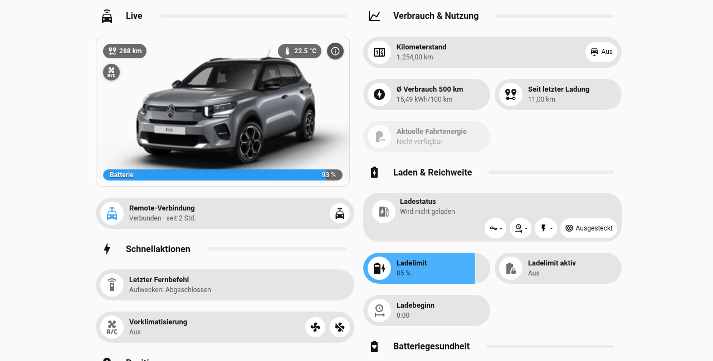
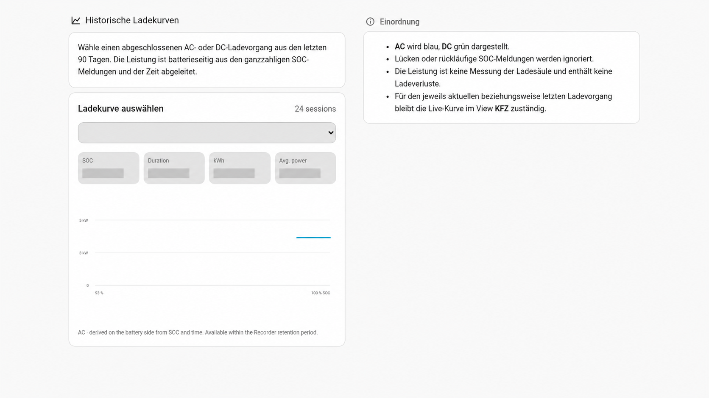
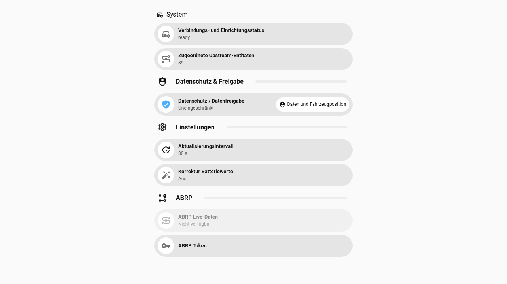
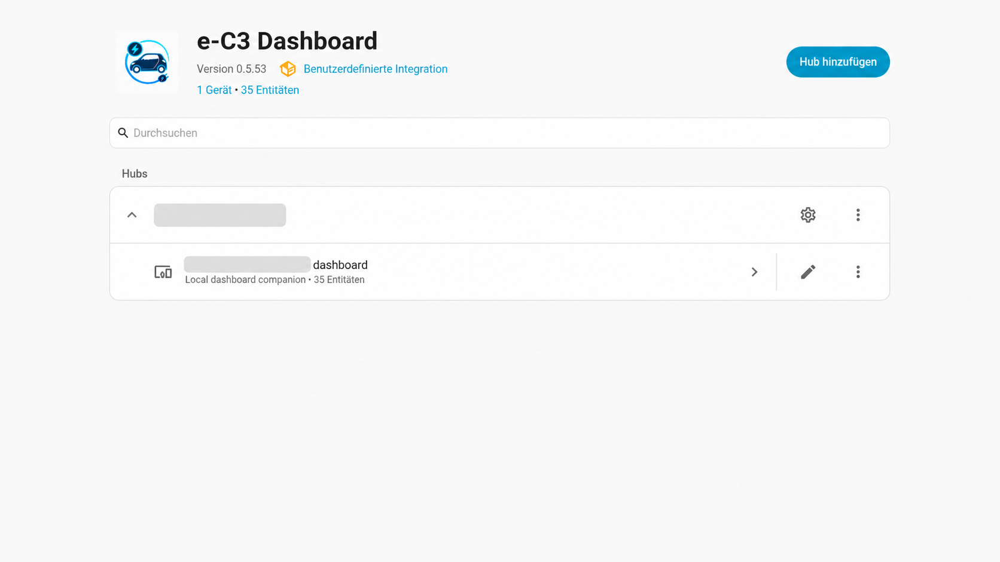

# Dashboard features

This document describes the generated e-C3 Dashboard as of the 0.5.53 feature set. Exact values and available controls depend on the upstream Stellantis entities exposed by the configured vehicle.

## Screenshots

The following public examples are visually reviewed and anonymized. Vehicle
history, map/location information, recipient details and integration-specific
identifiers are either omitted or covered by opaque redaction.

### Everyday views

### History and controls

### Integration and entities

## Vehicle

The Vehicle view is the primary day-to-day cockpit.

It includes:

- LIVE hero with vehicle picture and battery/SOC presentation;
- range;
- temperature or active charging information in the contextual status pill;
- remote-connection state;
- preconditioning/remote quick actions when the upstream capability exists;
- consumption and usage information;
- odometer/mileage;
- charging and range information;
- high-voltage battery health, including available SOH capacity/resistance data;
- 12-V/service-battery information;
- current position;
- latest trip;
- latest charge;
- trip history;
- charging history.

Range and the contextual right-hand hero value expose native Home Assistant More Info. Vehicle and maintenance information share one popup so the Vehicle view does not duplicate a separate administration card.

## Charging

The Charging view focuses on completed charging sessions and their historical shape.

Supported presentation includes:

- selection of completed AC/DC charging sessions;
- available start/end SOC information;
- duration;
- energy in kWh when derivable from the available source data;
- average charging power when derivable;
- a reconstructed historical charging curve.

The curve is reconstructed from available SOC/time history. It is vehicle-side derived history and must not be interpreted as a meter-grade wallbox power trace.

## Statistics

The Statistics view presents the long-term metrics that Home Assistant and the canonical dashboard data can support, including:

- SOH capacity;
- SOH resistance;
- mileage;
- driven distance;
- trailing average consumption over approximately 500 km.

### Long-term statistics caveat

Driven-distance charts rely on Home Assistant long-term statistics for the relevant source statistic. The dashboard deliberately does not conceal or silently rewrite malformed historical LTS segments. If Home Assistant already contains a statistics reset/discontinuity, a historical negative or otherwise implausible period can remain visible until that stored statistics history is corrected through a supported Home Assistant statistics path.

This caveat is separate from canonical trip-history repair.

## Trips

The Trips view uses a canonical server-history model rather than displaying every upstream server row as trusted data.

The view provides:

- canonical server history;
- an explicit server-history refresh action;
- filters;
- data-quality handling;
- controls for zero-distance and short trips.

Canonical processing applies plausibility guards before a trip may participate in downstream metrics. Invalid/unrepaired rows do not become odometer-continuity anchors for later trips.

When an upstream trip contains an implausible odometer boundary and sufficiently strong continuity evidence exists, the canonical layer may repair the derived start/end boundary. The original upstream/raw record remains unchanged for diagnostics. If the evidence is insufficient, the trip remains invalid instead of inventing a replacement distance.

## GPS

The GPS view combines local Home Assistant history and canonical server-side history.

The date controls include:

- Today;
- Yesterday;
- an explicit Home Assistant date/range picker;
- All.

The map/history layer can combine:

- Home Assistant Recorder points;
- canonical Stellantis server-history geometry;
- the current vehicle position as a separate live marker.

The current position is not treated as just another archived history point.

## Wake-up

Wake-up controls are deliberately conservative because an accepted remote command does not prove the vehicle is reachable again.

The view includes:

- wake vehicle now;
- hourly wake-up;
- reachability probe with wake-up;
- wake-up while charging;
- remote-connection status.

### Reachability probe semantics

If the reliable vehicle heartbeat becomes older than the configured reachability limit, the integration may send one wake-up as a probe. It then waits for the configured probe interval.

Recovery requires fresh, trustworthy vehicle data. A command status such as `accepted` or `forwarded` alone does not count as recovery.

## Notifications

Notifications are optional and recipient activation is explicit.

The generated view includes:

- master notification switch;
- vehicle warnings;
- trip reports;
- charging reports;
- explicitly selected recipients;
- recipient management;
- test notification;
- warning and reset thresholds;
- reachability controls;
- probe wait time;
- charging-start delay;
- quiet hours;
- diagnostics.

### Recipient safety

Notify-service discovery may make a Home Assistant recipient available for selection, but discovery must never silently activate that recipient. Sending remains opt-in.

Installation does not send a notification.

## System

The System view contains package/integration administration rather than everyday driving information.

It includes:

- connection and setup status;
- detected upstream entity count;
- privacy/data-sharing state;
- refresh interval;
- battery-value correction;
- ABRP controls and status where configured.

Keeping these controls in System prevents the Vehicle view from turning into a mixed operations/configuration page.

## Data ownership and privacy

The e-C3 Dashboard consumes Home Assistant entities created by the upstream Stellantis integration and stores its own derived/canonical data where needed. Raw upstream history used for diagnostics is not rewritten merely to make the UI look plausible.

When publishing screenshots or diagnostics, remove or redact at least:

- VIN/chassis number;
- exact street names and private locations;
- GPS coordinates;
- personal `mobile_app_*` or other Notify recipient names;
- config-entry IDs and other private identifiers;
- credentials, tokens and raw account exports.

Use opaque redaction for identifiers rather than reversible/weak visual obfuscation.
