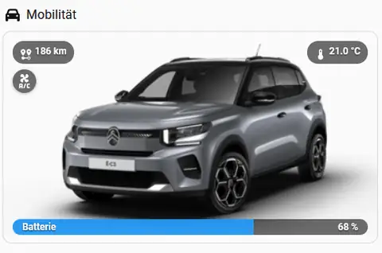

# e-C3 Fahrzeugübersicht für Home-Assistant-Startseiten

## Zweck

`custom:e-c3-dashboard-vehicle-overview-card` ist die portable Version der bereits produktiv genutzten Startseitenkarte. Das Layout wurde nicht neu gestaltet; die bestehende `Mobilität`-Karte wurde auf den Config-Entry-/Entity-Mapping-Vertrag von `e_c3_dashboard` portiert.

Seit 0.5.39 nutzt auch die automatisch erzeugte **LIVE-/Vehicle-Ansicht** dieselbe kanonische Fahrzeugübersicht mit `variant: live`. Dadurch existiert nicht mehr parallel ein zweiter Strategy-Hero-Bildpfad. Startseitenkarte und LIVE-Hero beziehen das Fahrzeugbild beide aus dem gemappten Live-Tracker.

Seit 0.5.40 sind die Interaktionen des LIVE-Hero ebenfalls wieder vollständig an die gemappten Home-Assistant-Entities gebunden: Restreichweite und Temperatur öffnen natives `more-info`, und die Vorklimatisierung verwendet den aktuellen HA-Action-Vertrag für `button.press`.



## Minimaler Einsatz

```yaml
type: custom:e-c3-dashboard-vehicle-overview-card
```

Bei genau einem konfigurierten e-C3-Fahrzeug reicht das aus. Die Karte erzeugt intern wieder:

- Heading `Mobilität`
- 270-px-Fahrzeug-Hero
- Reichweite oben links
- Ladeende/Ladestatus bzw. Temperatur oben rechts
- Vorklimatisierungsbutton
- Ladekabel-Indikator
- Fahrindikator
- transparente Navigation über der Fahrzeugfläche
- Batterie-Fortschrittsleiste mit Lade-/Fahrtstatus und Pulsanimation

## Optionale Konfiguration

```yaml
type: custom:e-c3-dashboard-vehicle-overview-card
entry_id: <e_c3_dashboard config-entry id>
navigation_path: /optional/override/vehicle
heading: Mobilität
heading_icon: fa6-solid:car
```

`entry_id` ist nur bei mehreren e-C3 Config Entries erforderlich. `navigation_path` ist ausschließlich ein Override.

`variant: live` ist ein interner Package-Pfad für den vom Dashboard erzeugten LIVE-Hero und muss für eine normale Startseitenkarte nicht gesetzt werden.

## Mapping statt haushaltsspezifischer IDs

Die frühere Karte enthielt VIN-/Gerätepfade und feste Entity-IDs. Die Package-Karte verwendet ausschließlich den Statusvertrag der ausgewählten `e_c3_dashboard` Config Entry:

- `vehicle_tracker`
- `entity_mapping.battery`
- `entity_mapping.autonomy`
- `entity_mapping.temperature`
- `entity_mapping.battery_charging`
- `entity_mapping.battery_charging_end`
- `entity_mapping.battery_plugged`
- `entity_mapping.engine`
- `entity_mapping.preconditioning`
- `entity_mapping.preconditioning_start`
- `entity_mapping.preconditioning_stop`
- `metric_entities.current_charge_power`
- `metric_entities.current_trip_energy`

Das Fahrzeugbild kommt live aus `hass.states[vehicle_tracker].attributes.entity_picture`. Die Wrapper-Karte überwacht diese URL ausdrücklich und baut die innere Button-Card neu, wenn das Bild erst nach dem ersten Render verfügbar wird oder sich ändert.

## Gemeinsamer LIVE-Hero ab 0.5.39

Die generierte `/vehicle`-Ansicht verwendet keine separate Hero-Implementierung mehr. Stattdessen wird die gleiche `custom:e-c3-dashboard-vehicle-overview-card` mit `variant: live` eingebettet.

Damit teilen sich Startseitenkarte und LIVE-Ansicht insbesondere:

- Tracker-/Config-Entry-Auflösung,
- `entity_picture`-Lifecycle,
- Range-/Temperatur-/SOC-Darstellung,
- Lade-, Kabel- und Fahrzustände,
- Vorklimatisierungsaktionen.

Map-Marker und Fahrzeug-Hero bleiben technisch getrennte Pfade; der transparente Kartenmarker darf das LIVE-Bild nicht nachpatchen.

## Interaktionen ab 0.5.40

Im LIVE-Hero sind die Statusbadges keine rein dekorativen HTML-Felder mehr:

- Tap auf **Restreichweite** öffnet natives Home-Assistant-`more-info` der gemappten `autonomy`-Entity inklusive des von HA bereitgestellten Historienplots.
- Tap auf **Temperatur** öffnet natives Home-Assistant-`more-info` der gemappten `temperature`-Entity inklusive Historie.
- Wenn rechts statt Temperatur ein Lade-/Ladeende-Status gezeigt wird, wird keine irreführende Temperatur-Aktion angeboten.
- Tap auf **Vorklimatisierung** führt `button.press` auf der gemappten `preconditioning_start`-Entity aus.
- Hold auf **Vorklimatisierung** führt `button.press` auf der gemappten `preconditioning_stop`-Entity aus.
- Die Aktionen verwenden Home Assistants `perform-action`/`perform_action`-Vertrag mit `target.entity_id`; feste Entity-IDs oder VIN-Ableitungen werden nicht verwendet.

Ein sichtbarer Start-/Stop-Button bestätigt nur, dass die gemappte Home-Assistant-Button-Entity vorhanden ist. Ob Stellantis den Remote-Befehl im konkreten Moment akzeptiert, muss bei Fehlern getrennt als Upstream-/Runtime-Fall diagnostiziert werden.

## Fahrzeug- und Wartungsdaten

Der LIVE-Informationsbutton öffnet den gemeinsamen Dialog **Fahrzeug- und Wartungsdaten**. Seit 0.5.40 gilt:

1. Wartungsinformationen stehen oben.
2. Fahrzeugdaten folgen darunter.
3. Die frühere eigenständige `Fahrzeuginformationen`-Karte im normalen Fahrzeugbereich entfällt.
4. Die öffentlichen `vehicle_info`-Attribute werden stattdessen im gemeinsamen Dialog gezeigt.

Fehlende Wartungswerte werden nicht erfunden. Wenn der optionale Stellantis-Maintenance-Endpunkt keine Daten liefert oder nicht verfügbar ist, bleibt die Darstellung bei den vorgesehenen Nicht-verfügbar-/Strichwerten.

Administrative Integrationsbereiche wie **Einstellungen** und **ABRP** gehören nicht mehr in den Fahrzeug-Hauptbereich; sie befinden sich im `system`-View.

## Navigation

Die alte Route `/dashboard-kfz/ec3` wird nicht verwendet. Standardmäßig wird aus `vehicle_slug` der vom Package erzeugte Dashboardpfad gebildet:

```text
/e-c3-<slug>/vehicle
```

## Bedienung

- Tap auf die mittlere Fahrzeugfläche: e-C3 Dashboard `/vehicle`
- Tap Restreichweite im LIVE-Hero: More Info des gemappten Autonomy-Sensors
- Tap Temperatur im LIVE-Hero: More Info des gemappten Temperatursensors, sofern Temperatur angezeigt wird
- Tap Vorklimatisierung: `button.press` auf gemapptes `preconditioning_start`
- Hold Vorklimatisierung: `button.press` auf gemapptes `preconditioning_stop`
- Tap Batteriezeile: More Info des gemappten Batteriesensors
- Tap Info im LIVE-Hero: gemeinsamer Fahrzeug-/Wartungsdialog

## Packaging

Die Karte ist ein internes ES-Modul des HACS-Integrationspakets. Sie bekommt **keinen eigenen Lovelace-Resource-Eintrag**. Der Package-Einstieg `frontend.js` lädt sie kontrolliert. Das gilt auch für die Nutzung als LIVE-Hero.

## Acceptance

Vor Promotion eines neuen Runtime-Candidates prüfen:

1. Karte erscheint im Card Picker als `e-C3 Fahrzeugübersicht`.
2. Minimal-YAML funktioniert.
3. Darstellung entspricht der bisherigen Startseitenkarte.
4. Fahrzeugbild erscheint ohne F5, auch wenn `entity_picture` verspätet kommt, und bleibt bei interner Navigation stabil.
5. Reichweite/Temperatur/Ladestatus/Kabel/Fahrt/Batterie reagieren live.
6. Tap Restreichweite öffnet More Info der gemappten Autonomy-Entity.
7. Tap Temperatur öffnet More Info der gemappten Temperatur-Entity, wenn Temperatur angezeigt wird.
8. Vorklimatisierung Tap = Start und Hold = Stop; ein Upstream-Fehler wird nicht durch Frontend-Fakes kaschiert.
9. Der Fahrzeug-/Wartungsdialog zeigt Wartung vor Fahrzeugdaten; fehlende Wartungsdaten werden klar als nicht verfügbar behandelt.
10. Keine separate `Fahrzeuginformationen`-Karte verbleibt im Fahrzeugbereich.
11. Einstellungen und ABRP sind im `system`-View vorhanden und nicht mehr im `vehicle`-View.
12. Navigation landet im package-owned e-C3 Dashboard `/vehicle`.
13. LIVE-/Vehicle-Ansicht verwendet dieselbe kanonische Overview-Card und keinen zweiten Hero-Bildpfad.
14. Keine VIN/festen Fahrzeug-Entity-IDs oder Legacy-KFZ-Route im Quellcode.
15. Karte bleibt Bestandteil des einen eC3-Frontend-Pakets und führt keinen neuen Nachpatchpfad ein.
